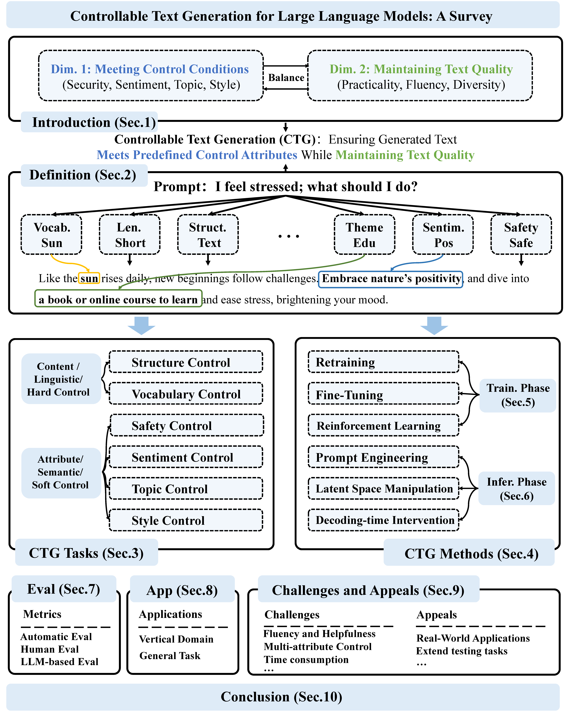

<h2>Controllable Text Generation for Large Language Models: A Survey</h2>

    <!-- arxiv badges -->
    
    <!-- Chinese Version -->
    
    <!-- Github -->
    
    <!-- HuggingFace -->
    

    

        <a href="https://scholar.google.com/citations?user=d0E7YlcAAAAJ">Xun Liang</a>1*, 
        <a href="https://scholar.google.com/citations?user=5LrD2HoAAAAJ">Hanyu Wang</a>1*, 
        <a href="https://scholar.google.com/citations?user=EzKQkhwAAAAJ">Yezhaohui Wang</a>2*,  
        <a href="https://ki-seki.github.io/">Shichao Song</a>1, 
        <a href="https://github.com/J1awei-Yang">Jiawei Yang</a>1, 
        <a href="https://github.com/siminniu">Simin Niu</a>1, 
        Jie Hu3, 
        Dan Liu3, 
        Shunyu Yao3, 
        <a href="https://scholar.google.com/citations?user=GOKgLdQAAAAJ">Feiyu Xiong</a>2, 
        <a href="https://www.semanticscholar.org/author/Zhiyu-Li/2268429641">Zhiyu Li</a>2†
    

    

        1<a href="https://en.ruc.edu.cn/">Renmin University of China</a>  
        2<a href="https://www.iaar.ac.cn/">Institute for Advanced Algorithms Research, Shanghai</a>  
        3<a href="https://www.chinatelecom.com.cn/">China Telecom Research Institute</a>
    

<small>*Equal contribution.</small>

<small>†Corresponding author: Zhiyu Li (<a href="mailto:lizy@iaar.ac.cn">lizy@iaar.ac.cn</a>).</small>

  <strong>🌟 STAR US! If you find our work helpful, please consider starring our GitHub to stay updated with the latest in Controllable Text Generation! 🌟</strong>

## 📰 News

- **[2024/08/26]** We have updated our paper list, which can now be accessed on our [GitHub page](https://github.com/IAAR-Shanghai/CTGSurvey).
- **[2024/08/23]** Our paper is published on the arXiv platform: https://arxiv.org/abs/2408.12599.
- **[2024/08/23]** Our paper secured the second position on Hugging Face's Daily Papers module: https://huggingface.co/papers/2408.12599.

## 🔗 Introduction

Welcome to the GitHub repository for our survey paper titled *"Controllable Text Generation for Large Language Models: A Survey."* This repository includes all the resources, code, and references related to the paper. Our objective is to provide a thorough overview of the techniques and methodologies used to control text generation in large language models (LLMs), with an emphasis on both theoretical underpinnings and practical implementations.

    

Our survey explores the following key areas:

### 🎯 Demands of Controllable Text Generation

Controllable Text Generation (CTG) must meet two main requirements:

1. **Meeting Predefined Control Conditions**: 
   Ensuring that the generated text adheres to specified criteria, such as thematic consistency, safety, and stylistic adherence.
   
2. **Maintaining Text Quality**: 
   Ensuring that the text produced is fluent, helpful, and diverse while balancing control with overall quality.

### 📜 Formal Definition of Controllable Text Generation

We define CTG as follows:

1. **Relationship with LLM Capabilities**:
   CTG is an ability dimension that is orthogonal to the objective knowledge capabilities of LLMs, focusing on how information is presented to meet specific needs, such as style or sentiment.

2. **Injection of Control Conditions**:
   Control conditions can be integrated into the text generation process at various stages using resources like text corpora, graphs, or databases.

3. **Quality of CTG**:
   High-quality CTG strikes a balance between adherence to control conditions and maintaining fluency, coherence, and helpfulness in the generated text.

### 🗂️ Classification of Controllable Text Generation Tasks

CTG tasks are categorized into two main types:

1. **Content Control (Linguistic Control/Hard Control)**: 
   Focuses on managing content structure, such as format and vocabulary.

2. **Attribute Control (Semantic Control/Soft Control)**: 
   Focuses on managing attributes like sentiment, style, and safety.

### 🔧 Controllable Text Generation Method Classification

CTG methods are systematically categorized into two stages:

1. **Training-Stage Methods**: 
   Techniques such as model retraining, fine-tuning, and reinforcement learning that occur during the training phase.
   
2. **Inference-Stage Methods**: 
   Techniques such as prompt engineering, latent space manipulation, and decoding-time intervention applied during inference.

### 📊 Evaluation Methods and Applications

We review the evaluation methods and their applications in CTG:

1. **Evaluation Methods**: 
   We introduce a range of automatic and human-based evaluation metrics, along with benchmarks that assess the effectiveness of CTG techniques, focusing on how well they balance control and text quality.

2. **Applications**: 
   We explore CTG applications across both specialized vertical domains and general tasks.

### 🚀 Challenges and Future Directions

This survey addresses key challenges in CTG research and suggests future directions:

1. **Key Challenges**: 
   Issues such as achieving precise control, maintaining fluency and coherence, and handling multi-attribute control in complex scenarios.

2. **Proposed Appeals**: 
   We advocate for a greater focus on real-world applications and the development of robust evaluation frameworks to advance CTG techniques.

This paper aims to provide valuable insights and guidance for researchers and developers working in the field of Controllable Text Generation. All references, along with a Chinese version of this survey, are open-sourced and available at [https://github.com/IAAR-Shanghai/CTGSurvey](https://github.com/IAAR-Shanghai/CTGSurvey).

## 📚 Paper List

We’ve compiled a comprehensive spreadsheet of all the papers we reviewed, accessible [here](https://www.yuque.com/matong-an7ob/qf04ed/yzs6n19swv6pipri). A more user-friendly table format is in progress.

Below, you'll find a categorized list of papers from 2023 and 2024, organized by Type, Phase, and Classification.

### Type: Method

#### Training Stage

##### Retraining

- **CTRL: A Conditional Transformer Language Model for Controllable Generation**  
  Salesforce Research, arxiv'19, 2019 [[Paper](https://arxiv.org/abs/1909.05858)]
- **Parallel Refinements for Lexically Constrained Text Generation with BART**  
  HKU, EMNLP'20, 2020 [[Paper](https://aclanthology.org/2021.emnlp-main.681/)]
- **PAIR: Planning and Iterative Refinement in Pre-trained Transformers for Long Text Generation**  
  Northeastern University, EMNLP'20, 2020 [[Paper](https://aclanthology.org/2020.emnlp-main.57/)]
- **Pre-Training Based Personalized Dialogue Generation Model with Persona-sparse Data**  
  THU, AAAI'20, 2020 [[Paper](https://ojs.aaai.org/index.php/AAAI/article/view/6518)]
- **POINTER: Constrained Progressive Text Generation via Insertion-based Generative Pre-training**  
  Microsoft, EMNLP'20, 2020 [[Paper](https://aclanthology.org/2020.emnlp-main.698/)]
- **CoCon: A Self-Supervised Approach for Controlled Text Generation**  
  NTU, ICLR'21, 2021 [[Paper](https://openreview.net/forum?id=VD_ozqvBy4W)]
- **A Simple and Efficient Multi-Task Learning Approach for Conditioned Dialogue Generation**  
  Universit´e de Montr´eal, NAACL'21, 2021 [[Paper](https://aclanthology.org/2021.naacl-main.392/)]
- **CHAE: Fine-Grained Controllable Story Generation with Characters, Actions and Emotions**  
  Tongji University, COLING'22, 2022 [[Paper](https://aclanthology.org/2022.coling-1.559/)]
- **Director: Generator-Classifiers For Supervised Language Modeling**  
  McGill University, IJCNLP'22, 2022 [[Paper](https://aclanthology.org/2022.aacl-main.39/)]
- **Emotional Text Generation with Hard Constraints**  
  Huaqiao University, ICFTIC'22, 2022 [[Paper](https://ieeexplore.ieee.org/abstract/document/10075091)]
- **FAST: Improving Controllability for Text Generation with Feedback Aware Self-Training**  
  Microsoft, arxiv'22, 2022 [[Paper](https://arxiv.org/abs/2210.03167)]
- **Fine-Grained Controllable Text Generation Using Non-Residual Prompting**  
  Research Institutes of Sweden, ACL'22, 2022 [[Paper](https://aclanthology.org/2022.acl-long.471/)]
- **Genre-Controllable Story Generation via Supervised Contrastive Learning**  
  Sungkyunkwan University, WWW'22, 2022 [[Paper](https://dl.acm.org/doi/10.1145/3485447.3512004)]
- **Fine-Grained Sentiment-Controlled Text Generation Approach Based on Pre-Trained Language Model**  
  Zhejiang University of Technology, Appl. Sci., 2023 [[Paper](https://www.mdpi.com/2076-3417/13/1/264)]
- **Lexical Complexity Controlled Sentence Generation for Language Learning**  
  BLCU, CCL'23, 2023 [[Paper](https://aclanthology.org/2023.ccl-1.56/)]
- **Semantic Space Grounded Weighted Decoding for Multi-Attribute Controllable Dialogue Generation**  
  Shanghai Jiao Tong University, EMNLP'23, 2023 [[Paper](https://aclanthology.org/2023.emnlp-main.817/)]
- **SweCTRL-Mini: a data-transparent Transformer-based large language model for controllable text generation in Swedish**  
  KTH Royal Institute of Technology, arxiv'23, 2023 [[Paper](https://arxiv.org/pdf/2304.13994)]

##### Fine-Tuning

- **Technical Report: Auxiliary Tuning and its Application to Conditional Text Generation**  
  AI21, arxiv'20, 2020 [[Paper](https://arxiv.org/abs/2006.16823)]
- **DisCup: Discriminator Cooperative Unlikelihood Prompt-tuning for Controllable Text Generation**  
  BIT, EMNLP'22, 2022 [[Paper](https://aclanthology.org/2022.emnlp-main.223/)]
- **Finetuned Language Models are Zero-Shot Learners**  
  Google, ICLR'22, 2022 [[Paper](https://openreview.net/forum?id=gEZrGCozdqR)]
- **MReD: A Meta-Review Dataset for Structure-Controllable Text Generation**  
  Alibaba, ACL'22_findings, 2022 [[Paper](https://aclanthology.org/2022.findings-acl.198/)]
- **Language Detoxification with Attribute-Discriminative Latent Space**  
  KAIST, ACL'23, 2023 [[Paper](https://aclanthology.org/2023.acl-long.565/)]
- **Controlled Text Generation with Hidden Representation Transformations**  
  UCLA, ACL'23_findings, 2023 [[Paper](https://aclanthology.org/2023.findings-acl.602/)]
- **CLICK: Controllable Text Generation with Sequence Likelihood Contrastive Learning**  
  THU, ACL'24_findings, 2023 [[Paper](https://aclanthology.org/2023.findings-acl.65/)]
- **Seen to Unseen: Exploring Compositional Generalization of Multi-Attribute Controllable Dialogue Generation**  
  BUPT, ACL'23, 2023 [[Paper](https://aclanthology.org/2023.acl-long.793/)]
- **DeepPress: guided press release topic-aware text generation using ensemble transformers**  
  Universite´ de Moncton,, Neural Computing and Applications, 2023 [[Paper](https://link.springer.com/article/10.1007/s00521-023-08393-4)]
- **DuNST: Dual Noisy Self Training for Semi-Supervised Controllable Text Generation**  
  The University of British Columbia, ACL'23, 2023 [[Paper](https://aclanthology.org/2023.acl-long.488/)]
- **Controlled text generation with natural language instructions**  
  ETH Zürich, ICML'23, 2023 [[Paper](https://dl.acm.org/doi/10.5555/3618408.3620203)]
- **Controlling keywords and their positions in text generation**  
  Hitachi, Ltd. Research and Development Group, INLG'23, 2023 [[Paper](https://aclanthology.org/2023.inlg-main.29/)]
- **Toward Unified Controllable Text Generation via Regular Expression Instruction**  
  ISCAS, IJCNLP-AACL'23, 2023 [[Paper](https://aclanthology.org/2023.ijcnlp-main.1/)]
- **Controllable Text Generation with Residual Memory Transformer**  
  BIT, arxiv'23, 2023 [[Paper](https://arxiv.org/abs/2309.16231)]
- **Continuous Language Model Interpolation for Dynamic and Controllable Text Generation**  
  Harvard University, arxiv'24, 2024 [[Paper](https://arxiv.org/abs/2404.07117)]
- **CoDa: Constrained Generation based Data Augmentation for Low-Resource NLP**  
  UMD, arxiv'24, 2024 [[Paper](https://arxiv.org/abs/2404.00415)]
- **Contrastive Perplexity for Controlled Generation: An Application in Detoxifying Large Language Models**  
  SAP, arxiv'24, 2024 [[Paper](https://arxiv.org/abs/2401.08491)]
- **CTGGAN: Controllable Text Generation with Generative Adversarial Network**  
  JIUTIAN Team, China Mobile Research, Appl. Sci., 2024 [[Paper](https://www.mdpi.com/2076-3417/14/7/3106)]
- **ECCRG: A Emotion- and Content-Controllable Response Generation Model**  
  TJU, Lecture Notes of the Institute for Computer Sciences, Social Informatics and Telecommunications Engineering, 2024 [[Paper](https://link.springer.com/chapter/10.1007/978-3-031-54528-3_7)]
- **LiFi: Lightweight Controlled Text Generation with Fine-Grained Control Codes**  
  THU, arxiv'24, 2024 [[Paper](https://arxiv.org/abs/2402.06930)]

##### Reinforcement Learning

- **Learning to summarize with human feedback**  
  OpenAI, NeurIPS'20, 2020 [[Paper](https://proceedings.neurips.cc/paper/2020/hash/1f89885d556929e98d3ef9b86448f951-Abstract.html)]
- **A Distributional Approach to Controlled Text Generation**  
  Muhammad Khalifa, ICLR'21, 2021 [[Paper](https://openreview.net/forum?id=jWkw45-9AbL)]
- **Efficient Reinforcement Learning for Unsupervised Controlled Text Generation**  
  agaralabs, arxiv'22, 2022 [[Paper](https://arxiv.org/abs/2204.07696)]
- **Training language models to follow instructions with human feedback**  
  openAI, NeurIPS'22, 2022 [[Paper](https://openreview.net/forum?id=TG8KACxEON)]
- **STEER: Unified Style Transfer with Expert Reinforcement**  
  University of Washington, EMNLP'23_findings, 2023 [[Paper](https://aclanthology.org/2023.findings-emnlp.506/)]
- **Prompt-Based Length Controlled Generation with Multiple Control Types**  
  NWPU, ACL'24_findings, 2024 [[Paper](https://aclanthology.org/2024.findings-acl.63/)]
- **Reinforcement Learning with Dynamic Multi-Reward Weighting for Multi-Style Controllable Generation**  
  University of Minnesota, arxiv'24, 2024 [[Paper](https://arxiv.org/abs/2402.14146)]
- **Safe RLHF: Safe Reinforcement Learning from Human Feedback**  
  PKU, ICLR'24_spotlight, 2024 [[Paper](https://openreview.net/forum?id=TyFrPOKYXw)]
- **Token-level Direct Preference Optimization**  
  IACAS, arxiv'24, 2024 [[Paper](https://arxiv.org/abs/2404.11999)]
- **Reinforcement Learning with Token-level Feedback for Controllable Text Generation**  
  HUST, NAACL'24, 2024 [[Paper](https://arxiv.org/abs/2403.11558)]

#### Inference Stage

##### Prompt Engineering

- **AutoPrompt: Eliciting Knowledge from Language Models with Automatically Generated Prompts**  
  UCI&UCB, EMNLP'20, 2020 [[Paper](https://aclanthology.org/2020.emnlp-main.346/)]
- **Attribute Alignment: Controlling Text Generation from Pre-trained Language Models**  
  University of California, EMNLP'21_findings, 2021 [[Paper](https://aclanthology.org/2021.findings-emnlp.194/)]
- **GPT Understands, Too**  
  THU, arxiv'21, 2021 [[Paper](https://arxiv.org/abs/2103.10385)]
- **Prefix-Tuning: Optimizing Continuous Prompts for Generation**  
  University of California, Santa Barbara, ACL'21, 2021 [[Paper](https://aclanthology.org/2021.acl-long.353/)]
- **The Power of Scale for Parameter-Efficient Prompt Tuning**  
  Google, EMNLP'21, 2021 [[Paper](https://aclanthology.org/2021.emnlp-main.243/)]
- **Controllable Natural Language Generation with Contrastive Prefixes**  
  UCSB, ACL'22_findings, 2022 [[Paper](https://aclanthology.org/2022.findings-acl.229/)]
- **A Distributional Lens for Multi-Aspect Controllable Text Generation**  
  HIT, EMNLP'22_oral, 2022 [[Paper](https://aclanthology.org/2022.emnlp-main.67/)]
- **P-Tuning v2: Prompt Tuning Can Be Comparable to Fine-tuning Across Scales and Tasks**  
  THU, ACL'22, 2022 [[Paper](https://aclanthology.org/2022.acl-short.8/)]
- **Controlled Text Generation using T5 based Encoder-Decoder Soft Prompt Tuning and Analysis of the Utility of Generated Text in AI**  
  Queen Mary University of London, arxiv'22, 2022 [[Paper](https://arxiv.org/abs/2212.02924)]
- **Controllable Generation of Dialogue Acts for Dialogue Systems via Few-Shot Response Generation and Ranking**  
  University of California Santa Cruz, SIGDIAL'23, 2023 [[Paper](https://aclanthology.org/2023.sigdial-1.32/)]
- **PCFG-based Natural Language Interface Improves Generalization for Controlled Text Generation**  
  Johns Hopkins University, SEM'23, 2023 [[Paper](https://aclanthology.org/2023.starsem-1.27/)]
- **Harnessing the Plug-and-Play Controller by Prompting**  
  BUAA, GEM'23, 2023 [[Paper](https://aclanthology.org/2023.gem-1.14/)]
- **An Extensible Plug-and-Play Method for Multi-Aspect Controllable Text Generation**  
  THU&Meituan, ACL'23, 2023 [[Paper](https://aclanthology.org/2023.acl-long.849/)]
- **Tailor: A Soft-Prompt-Based Approach to Attribute-Based Controlled Text Generation**  
  Alibaba, ACL'23, 2023 [[Paper](https://aclanthology.org/2023.acl-long.25/)]
- **InstructCMP: Length Control in Sentence Compression through Instruction-based Large Language Models**  
  CNU, ACL'24_findings, 2024 [[Paper](https://aclanthology.org/2024.findings-acl.532/)]
- **Topic-Oriented Controlled Text Generation for Social Networks**  
  WHU, Journal of Signal Processing Systems, 2024 [[Paper](https://link.springer.com/article/10.1007/s11265-023-01907-2)]
- **Plug and Play with Prompts: A Prompt Tuning Approach for Controlling Text Generation**  
  University of Toronto, AAAI'24_workshop, 2024 [[Paper](https://arxiv.org/abs/2404.05143)]
- **TrustAgent: Towards Safe and Trustworthy LLM-based Agents through Agent Constitution**  
  UCSB, arxiv'24, 2024 [[Paper](https://arxiv.org/abs/2402.01586)]

##### Latent Space Manipulation

- **Deep Extrapolation for Attribute-Enhanced Generation**  
  Salesforce Research, NeurIPS'21, 2021 [[Paper](https://openreview.net/forum?id=NCDMYD2y5kK)]
- **Extracting Latent Steering Vectors from Pretrained Language Models**  
  Allen Institute for Artificial Intelligence, ACL'22_findings, 2022 [[Paper](https://aclanthology.org/2022.findings-acl.48/)]
- **Activation Addition: Steering Language Models Without Optimization**  
  UC Berkeley, arxiv'23, 2023 [[Paper](https://arxiv.org/abs/2308.10248)]
- **Evaluating, Understanding, and Improving Constrained Text Generation
  for Large Language Models**  
  PKU, arxiv'23, 2023 [[Paper](https://arxiv.org/pdf/2310.16343)]
- **In-context Vectors: Making In Context Learning More Effective and Controllable Through Latent Space Steering**  
  Stanford University, arxiv'23, 2023 [[Paper](https://arxiv.org/abs/2311.06668)]
- **MacLaSa: Multi-Aspect Controllable Text Generation via Efficient Sampling from Compact Latent Space**  
  ICT CAS, EMNLP'23_findings, 2023 [[Paper](https://aclanthology.org/2023.findings-emnlp.292/)]
- **Miracle: Towards Personalized Dialogue Generation with Latent-Space Multiple Personal Attribute Control**  
  HUST, EMNLP'23_findings, 2023 [[Paper](https://aclanthology.org/2023.findings-emnlp.395/)]
- **Controllable Text Generation via Probability Density Estimation in the Latent Space**  
  HIT, EMNLP'23, 2023 [[Paper](https://aclanthology.org/2023.acl-long.704/)]
- **Self-Detoxifying Language Models via Toxification Reversal**  
  The Hong Kong Polytechnic University, EMNLP'23, 2023 [[Paper](https://aclanthology.org/2023.emnlp-main.269/)]
- **DESTEIN: Navigating Detoxification of Language Models via Universal Steering Pairs and Head-wise Activation Fusion**  
  Tongji University, arxiv'24, 2024 [[Paper](https://arxiv.org/abs/2404.10464)]
- **FreeCtrl: Constructing Control Centers with Feedforward Layers for Learning-Free Controllable Text Generation**  
  NTU, ACL'24, 2024 [[Paper](https://aclanthology.org/2024.acl-long.412/)]
- **InferAligner: Inference-Time Alignment for Harmlessness through Cross-Model Guidance**  
  FuDan, arxiv'24, 2024 [[Paper](https://arxiv.org/abs/2401.11206)]
- **Multi-Aspect Controllable Text Generation with Disentangled Counterfactual Augmentation**  
  NJU, ACL'24, 2024 [[Paper](https://aclanthology.org/2024.acl-long.500/)]
- **Style Vectors for Steering Generative Large Language Models**  
  German Aerospace Center (DLR), EACL'24_findings, 2024 [[Paper](https://aclanthology.org/2024.findings-eacl.52/)]

##### Decoding-time Intervention

- **Generalization through Memorization: Nearest Neighbor Language Models**  
  Urvashi Khandelwal, ICLR'20, 2020 [[Paper](https://openreview.net/forum?id=HklBjCEKvH)]
- **MEGATRON-CNTRL: Controllable Story Generation with External Knowledge Using Large-Scale Language Models**  
  USTHK, EMNLP'20, 2020 [[Paper](https://aclanthology.org/2020.emnlp-main.226/)]
- **Plug-and-Play Conversational Models**  
  USTHK, EMNLP'20 findings, 2020 [[Paper](https://aclanthology.org/2020.findings-emnlp.219/)]
- **Plug and Play Language Models: A Simple Approach to Controlled Text Generation**  
  California Institute of Technology, ICLR'20, 2020 [[Paper](https://openreview.net/forum?id=H1edEyBKDS)]
- **DExperts: Decoding-Time Controlled Text Generation with Experts and Anti-Experts**  
  University of Washington, ACL'21, 2021 [[Paper](https://aclanthology.org/2021.acl-long.522/)]
- **FUDGE: Controlled Text Generation With Future Discriminators**  
  UC Berkeley, NAACL'21, 2021 [[Paper](https://aclanthology.org/2021.naacl-main.276/)]
- **GeDi: Generative Discriminator Guided Sequence Generation**  
  Salesforce Research, EMNLP'21, 2021 [[Paper](https://aclanthology.org/2021.findings-emnlp.424/)]
- **Controllable Generation from Pre-trained Language Models via Inverse Prompting**  
  THU, KDD'21, 2021 [[Paper](https://dl.acm.org/doi/10.1145/3447548.3467418)]
- **A Plug-and-Play Method for Controlled Text Generation**  
  ETH Zürich, EMNLP'21 findings, 2021 [[Paper](https://aclanthology.org/2021.findings-emnlp.334/)]
- **Controlled Text Generation as Continuous Optimization with Multiple Constraints**  
  CMU, NeurIPS'21, 2021 [[Paper](https://openreview.net/forum?id=kTy7bbm-4I4)]
- **NeuroLogic Decoding: (Un)supervised Neural Text Generation with Predicate Logic Constraints**  
  Allen Institute for Artificial Intelligence, NAACL'21, 2021 [[Paper](https://aclanthology.org/2021.naacl-main.339/)]
- **Plug-and-Blend: A Framework for Controllable Story Generation with Blended Control Codes**  
  Georgia Institute of Technology, Workshop on Narrative Understanding'21, 2021 [[Paper](https://aclanthology.org/2021.nuse-1.7/)]
- **A Causal Lens for Controllable Text Generation**  
  UC San Diego, NeurIPS'21, 2021 [[Paper](https://openreview.net/forum?id=kAm9By0R5ME)]
- **Self-Diagnosis and Self-Debiasing: A Proposal for Reducing Corpus-Based Bias in NLP**  
  LMU Munich, TACL'21, 2021 [[Paper](https://aclanthology.org/2021.tacl-1.84/)]
- **Controllable Text Generation for All Ages: Evaluating a Plug-and-Play Approach to Age-Adapted Dialogue**  
  University of Amsterdam, GEM'22, 2022 [[Paper](https://aclanthology.org/2022.gem-1.14/)]
- **BeamR: Beam Reweighing with Attribute Discriminators for Controllable Text Generation**  
  Vanguard, AACL'22_findings, 2022 [[Paper](https://aclanthology.org/2022.findings-aacl.40/)]
- **Classifiers are Better Experts for Controllable Text Generation**  
  Tinkoff, NeurIPS'22 workshop Transfer Learning for Natural Language Processing, 2022 [[Paper](https://neurips.cc/virtual/2022/56576)]
- **Improving Controllable Text Generation with Position-Aware Weighted Decoding**  
  HIT, ACL'22_findings, 2022 [[Paper](https://aclanthology.org/2022.findings-acl.272/)]
- **Controllable Text Generation with Language Constraints**  
  Princeton University, arxiv, 2022 [[Paper](https://arxiv.org/abs/2212.10466)]
- **COLD Decoding: Energy-based Constrained Text Generation with Langevin Dynamics**  
  University of Washington, NeurIPS'22, 2022 [[Paper](https://papers.nips.cc/paper_files/paper/2022/hash/3e25d1aff47964c8409fd5c8dc0438d7-Abstract-Conference.html)]
- **Collocation2Text: Controllable Text Generation from Guide Phrases in Russian**  
  Vyatka State University, Dialogue-2022 conference, 2022 [[Paper](https://www.dialog-21.ru/media/5794/vychegzhaninsvpluskotelnikovev076.pdf)]
- **CounterGeDi: A Controllable Approach to Generate Polite, Detoxified and Emotional Counterspeech**  
  Indian Institute of Technology, IJCAI'22, 2022 [[Paper](https://www.ijcai.org/proceedings/2022/716)]
- **Bridging the Gap Between Training and Inference of Bayesian Controllable Language Models**  
  THU, arxiv'22, 2022 [[Paper](https://arxiv.org/abs/2206.05519v1)]
- **Nearest Neighbor Language Models for Stylistic Controllable Generation**  
  University of Marburg, GEM'22, 2022 [[Paper](https://aclanthology.org/2022.gem-1.25/)]
- **Mix and Match: Learning-free Controllable Text Generationusing Energy Language Models**  
  University of California San Diego, ACL'22, 2022 [[Paper](https://aclanthology.org/2022.acl-long.31/)]
- **Gradient-based Constrained Sampling from Language Models**  
  CMU, EMNLP'22, 2022 [[Paper](https://aclanthology.org/2022.emnlp-main.144/)]
- **Controllable Text Generation with Neurally-Decomposed Oracle**  
  UCLA, NeruIPS'22, 2022 [[Paper](https://papers.nips.cc/paper_files/paper/2022/hash/b40d5797756800c97f3d525c2e4c8357-Abstract-Conference.html)]
- **NeuroLogic A*esque Decoding: Constrained Text Generation with Lookahead Heuristics**  
  Allen Institute for Artificial Intelligence, NAACL'22, 2022 [[Paper](https://aclanthology.org/2022.naacl-main.57/)]
- **Plug-and-Play Recipe Generation with Content Planning**  
  University of Cambridge, EMNLP 2022 GEM workshop, 2022 [[Paper](https://aclanthology.org/2022.gem-1.19/)]
- **Sequentially Controlled Text Generation**  
  University of Southern California, EMNLP'22, 2022 [[Paper](https://aclanthology.org/2022.findings-emnlp.509/)]
- **Air-Decoding: Attribute Distribution Reconstruction for Decoding-Time Controllable Text Generation**  
  USTC, EMNLP'23, 2023 [[Paper](https://aclanthology.org/2023.emnlp-main.512/)]
- **A Block Metropolis-Hastings Sampler for Controllable Energy-based Text Generation**  
  UCSD, CoNLL'23, 2023 [[Paper](https://aclanthology.org/2023.conll-1.26/)]
- **BOLT: Fast Energy-based Controlled Text Generation with Tunable Biases**  
  University of Michigan, ACL'23_short, 2023 [[Paper](https://aclanthology.org/2023.acl-short.18/)]
- **Controlled Decoding from Language Models**  
  Google, NeurIPS_SoLaR'23, 2023 [[Paper](https://openreview.net/forum?id=jo57H1CpD8)]
- **Focused Prefix Tuning for Controllable Text Generation**  
  Tokyo Institute of Technology, ACL'23_short, 2023 [[Paper](https://aclanthology.org/2023.findings-acl.281/)]
- **Focused Prefix Tuning for Controllable Text Generation**  
  Tokyo Tech, ACL'23_short, 2023 [[Paper](https://aclanthology.org/2023.acl-short.96/)]
- **Goodtriever: Adaptive Toxicity Mitigation with Retrieval-augmented Models**  
  Cohere For AI, EMNLP'23_findings, 2023 [[Paper](https://aclanthology.org/2023.findings-emnlp.339/)]
- **GRACE: Gradient-guided Controllable Retrieval for Augmenting Attribute-based Text Generation**  
  National University of Defense Technology, ACL'23_findings, 2023 [[Paper](https://aclanthology.org/2023.findings-acl.530/)]
- **An Invariant Learning Characterization of Controlled Text Generation**  
  Columbia University, ACL'23, 2023 [[Paper](https://aclanthology.org/2023.acl-long.179/)]
- **Style Locality for Controllable Generation with kNN Language Models**  
  University of Marburg, SIGDIAL'23_TamingLLM workshop, 2023 [[Paper](https://aclanthology.org/2023.tllm-1.7/)]
- **Detoxifying Text with MaRCo: Controllable Revision with Experts and Anti-Experts**  
  University of Washington&CMU, ACL'23_short, 2023 [[Paper](https://aclanthology.org/2023.acl-short.21/)]
- **MIL-Decoding: Detoxifying Language Models at Token-Level via Multiple Instance Learning**  
  PKU, ACL'23, 2023 [[Paper](https://doi.org/10.18653/v1%2F2023.acl-long.11)]
- **Controllable Story Generation Based on Perplexity Minimization**  
  Vyatka State University, AIST 2023, 2023 [[Paper](https://link.springer.com/chapter/10.1007/978-3-031-54534-4_11)]
- **PREADD: Prefix-Adaptive Decoding for Controlled Text Generation**  
  UC Berkeley, ACL'23_findings, 2023 [[Paper](https://aclanthology.org/2023.findings-acl.636/)]
- **Reward-Augmented Decoding: Efficient Controlled Text Generation With a Unidirectional Reward Model**  
  UNC-Chapel Hill, EMNLP'23_short, 2023 [[Paper](https://aclanthology.org/2023.emnlp-main.721/)]
- **Controlled Text Generation for Black-box Language Models via Score-based Progressive Editor**  
  Seoul National University, ACL'24, 2023 [[Paper](https://aclanthology.org/2024.acl-long.767/)]
- **Successor Features for Efficient Multisubject Controlled Text Generation**  
  Microsoft, arxiv'23, 2023 [[Paper](https://arxiv.org/abs/2311.04921)]
- **Controlled Text Generation via Language Model Arithmetic**  
  ETH Zurich, ICLR'24_spotlight, 2024 [[Paper](https://openreview.net/forum?id=SLw9fp4yI6)]
- **COLD-Attack: Jailbreaking LLMs with Stealthiness and Controllability**  
  UIUC, arxiv'24, 2024 [[Paper](https://arxiv.org/abs/2402.08679)]
- **Controlled Text Generation for Large Language Model with Dynamic Attribute Graphs**  
  RUC, arxiv'24, 2024 [[Paper](https://aclanthology.org/2024.findings-acl.345/)]
- **DECIDER: A Rule-Controllable Decoding Strategy for Language Generation by Imitating Dual-System Cognitive Theory**  
  BIT, TKDE_submitted, 2024 [[Paper](https://arxiv.org/abs/2403.01954)]
- **Word Embeddings Are Steers for Language Models**  
  UIUC, ACL'24, 2024 [[Paper](https://arxiv.org/abs/2305.12798v2)]
- **RAIN: Your Language Models Can Align Themselves without Finetuning**  
  PKU, ICLR'24, 2024 [[Paper](https://openreview.net/forum?id=pETSfWMUzy)]
- **ROSE Doesn't Do That: Boosting the Safety of Instruction-Tuned Large Language Models with Reverse Prompt Contrastive Decoding**  
  WHU, arxiv'24, 2024 [[Paper](https://arxiv.org/abs/2402.11889)]
- **Uncertainty is Fragile: Manipulating Uncertainty in Large Language Models**  
  Rutgers, arxiv'24, 2024 [[Paper](https://arxiv.org/abs/2407.11282)]

### Type: Survey

- **Exploring Controllable Text Generation Techniques**  
  CMU, COLING'20, 2023 [[Paper](https://dl.acm.org/doi/10.1145/3617680)]
- **Conditional Text Generation for Harmonious Human-Machine Interaction**  
  NWPT, TIST'21, 2021 [[Paper](https://dl.acm.org/doi/10.1145/3439816#core-collateral-purchase-access)]
- **How to Control Sentiment in Text Generation: A Survey of the State-of-the-Art in Sentiment-Control Techniques**  
  DCU, WASSA'23, 2023 [[Paper](https://aclanthology.org/2023.wassa-1.30/)]
- **A Survey of Controllable Text Generation using Transformer-based Pre-trained Language Models**  
  BIT, ACM CSUR, 2023 [[Paper](https://dl.acm.org/doi/10.1145/3617680)]
- **A Recent Survey on Controllable Text Generation: A Causal Perspective**  
  Tongji, Fundamental Research, 2024 [[Paper](https://www.sciencedirect.com/science/article/pii/S2667325824000062)]